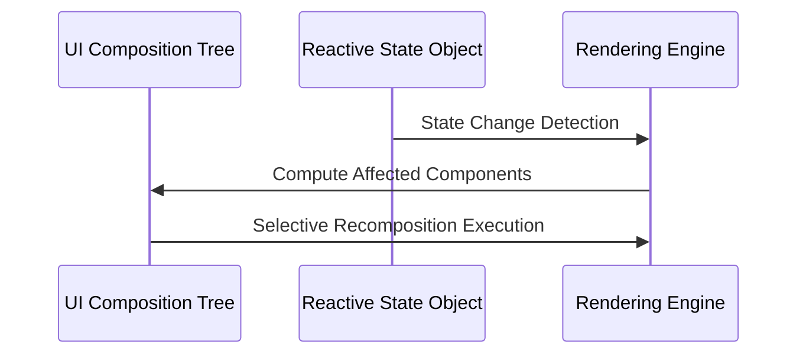
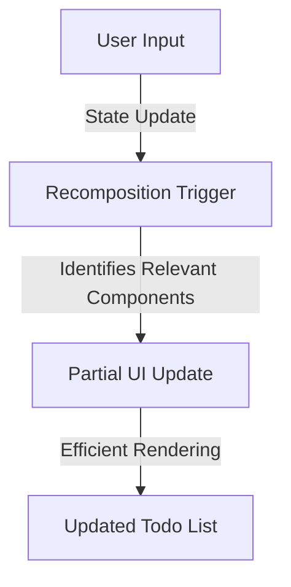

# Aero: A Theoretical and Practical Examination

## Abstract
This document provides an in-depth analysis of a Kotlin-based multiplatform graphical user interface (GUI) framework, architected upon declarative programming paradigms inspired by **Jetpack Compose** and informed by **Apple’s Human Interface Guidelines (HIG)**. The framework is designed to facilitate seamless user interface construction across OpenGL, Skija, and Vulkan while ensuring efficient state management, optimal rendering, and strict adherence to contemporary UX principles. This study delineates the theoretical underpinnings, implementation details, and performance considerations of the framework, offering both conceptual insights and practical applications.

## Introduction
### Rationale and Design Motivation
The evolution of modern UI development has necessitated the adoption of declarative paradigms, particularly in the realm of multiplatform applications. Traditional imperative UI programming presents scalability challenges and introduces inefficiencies in state synchronization, necessitating the exploration of functionally-driven solutions. This library leverages the power of **state-driven recomposition**, ensuring minimal computational overhead while maintaining UI consistency.

Drawing inspiration from **Jetpack Compose**, the framework enables UI elements to be structured as functions, dynamically recalibrating their representation in response to state mutations. Concurrently, Apple’s **Human Interface Guidelines (HIG)** serve as a foundational reference for maintaining platform-native aesthetics and interaction models. This alignment ensures that applications adhere to industry-leading UX principles across disparate operating systems.

## Key Features
- **Declarative UI Construction**: UI components are defined as composable functions, facilitating clarity, modularity, and testability.
- **Efficient State Management**: Through **mutableStateOf**, recomposition is optimized to minimize redundant rendering operations.
- **Cross-Platform Interoperability**: The framework seamlessly integrates across OpenGL, Skija, and Vulkan, ensuring a unified development experience.
- **Component-Based Modularity**: Function-oriented UI construction fosters reusability and separation of concerns.
- **Performance Optimization via Selective Recomposition**: Only state-dependent UI elements undergo re-evaluation, preventing unnecessary reprocessing.
- **Adherence to Platform UX Guidelines**: Jetpack Compose’s reactive principles and Apple’s HIG serve as referential frameworks for intuitive and aesthetically coherent designs.

## Architectural Overview
### Declarative Component Structure
Each UI component is structured as a **pure function** that derives its presentation from an encapsulated state object. This abstraction enables a reactive UI that dynamically synchronizes with data mutations.

```kotlin
@Composable
fun CounterApp() {
    var count by remember { mutableStateOf(0) }
    Column {
        Text("Count: $count")
        Button("Increment") { count++ }
    }
}
```

- **State Encapsulation (`mutableStateOf`)**: Establishes reactive bindings between UI components and their underlying data models.
- **Declarative Event Handling (`Button` Interaction)**: Ensures seamless UI mutations while adhering to unidirectional data flow principles.
- **Composable UI Functions (`@Composable`)**: Denotes modular UI units that participate in the composition tree.

### Theoretical Model of Recomposition
Recomposition is orchestrated through a state-diffing mechanism that recalibrates only the affected UI subsets. The recomposition process can be visualized through the following flow:



This methodology ensures **computational efficiency** by limiting reprocessing operations to **differentially affected components**.

## Practical Implementations
### Case Study: Dynamic Todo List
```kotlin
@Composable
fun TodoApp() {
    var todos by remember { mutableStateOf(listOf("Buy Milk", "Read Book")) }
    var newTodo by remember { mutableStateOf("") }
    
    Column {
        TextField(value = newTodo, onValueChange = { newTodo = it })
        Button("Add Todo") {
            if (newTodo.isNotBlank()) {
                todos = todos + newTodo
                newTodo = ""
            }
        }
        todos.forEach { todo -> Text(todo) }
    }
}
```

### Computational Complexity of Recomposition
- **Localized Recomposition**: When a new item is appended to `todos`, only the relevant `Column` recomposes, preserving computational efficiency.
- **Independent State Mutations**: The `TextField` operates autonomously, avoiding unnecessary re-renders of the todo list.



## Advanced State Management
### Scoped State Preservation
Encapsulating state within specific composable functions prevents global recomposition, thereby maintaining localized performance efficiency.

```kotlin
@Composable
fun ParentComponent() {
    var parentState by remember { mutableStateOf("Parent State") }
    Column {
        Text("Parent: $parentState")
        ChildComponent()
    }
}

@Composable
fun ChildComponent() {
    var childState by remember { mutableStateOf("Child State") }
    Column {
        Text("Child: $childState")
        Button("Update Child") { childState = "Updated Child State" }
    }
}
```

Here, **state isolation** ensures that modifications to `childState` do not trigger unnecessary recompositions in `ParentComponent`.

### Optimization of Large-Scale Datasets
Efficient rendering of extensive datasets necessitates virtualization techniques. The framework employs **lazy composition** to restrict rendering to visible UI elements.

```kotlin
@Composable
fun LargeList(items: List<String>) {
    LazyColumn {
        items(items) { item ->
            Text(item)
        }
    }
}
```

Through **lazy rendering**, inactive list elements are deferred until explicitly required, conserving memory and processing resources.

